# CX Dependency Graph (CX-00A → CX-31)

```mermaid
flowchart TD
  %% Wave 0
  subgraph W0["Wave 0"]
    CX00A["CX-00A: Systems Glossary (DONE)"]
  end

  %% Wave 1
  subgraph W1["Wave 1"]
    CX01["CX-01: Agent Config & Task Architecture (OPEN)"]
    CX02["CX-02: Historical Events Scaffold (DONE)"]
    CX03["CX-03: Zip Converter Utilities (DONE)"]
    CX04["CX-04: Inventory & Progress Truth Tables (DONE)"]
    CX05["CX-05: Markdownlint Configuration (DONE)"]
    CX06["CX-06: Frontmatter Schema & Validator (DONE)"]
    CX08["CX-08: SQL Schema Materialization (DONE)"]
  end

  %% Wave 2
  subgraph W2["Wave 2"]
    CX07["CX-07: CI Lint Workflow (DONE)"]
    CX09["CX-09: Axis Weight Declarations (DONE)"]
    CX10["CX-10: Type & Color Weight Declarations (DONE)"]
    CX13["CX-13: Exercise Library Parser (DONE)"]
    CX16["CX-16: Deck Identity Scaffold Generator (DONE)"]
    CX17["CX-17: Ralph Loop Validation & Batch (OPEN)"]
    CX18["CX-18: Design Tokens & WeightCSS Spec (OPEN)"]
    CX19["CX-19: Agent Boundaries Document (OPEN)"]
    CX20["CX-20: Room Schema Extension (OPEN)"]
    CX21["CX-21: Content Type Registry (OPEN)"]
    CX23["CX-23: Navigation Graph Builder (OPEN)"]
    CX26["CX-26: Operis Room Manifest Generator (OPEN)"]
    CX28["CX-28: Cosmogram Content Scaffold (OPEN)"]
  end

  %% Wave 3
  subgraph W3["Wave 3"]
    CX11["CX-11: Block Weight Declarations (OPEN)"]
    CX12["CX-12: Operator Weight Declarations (OPEN)"]
    CX14["CX-14: Weight Vector Computation Engine (OPEN)"]
    CX22["CX-22: Floor Routing Spec (OPEN)"]
    CX24["CX-24: Bloom State Engine (OPEN)"]
    CX27["CX-27: Superscript/Subscript Data Model (OPEN)"]
  end

  %% Wave 4
  subgraph W4["Wave 4"]
    CX15["CX-15: Exercise Selection Prototype (OPEN)"]
    CX25["CX-25: Vote Weight Integration (OPEN)"]
    CX29["CX-29: Wilson Audio Route Scaffold (OPEN)"]
    CX30["CX-30: Envelope Schema & Stamping Prototype (OPEN)"]
  end

  %% Wave 5
  subgraph W5["Wave 5"]
    CX31["CX-31: Envelope Similarity & Retrieval Prototype (OPEN)"]
  end

  %% Dependency edges (blocker --> dependent)
  CX00A --> CX01
  CX00A --> CX02
  CX00A --> CX03
  CX00A --> CX04
  CX00A --> CX05
  CX00A --> CX06
  CX00A --> CX08
  CX00A --> CX09
  CX00A --> CX10
  CX00A --> CX13
  CX00A --> CX18
  CX00A --> CX19
  CX00A --> CX21

  CX05 --> CX07
  CX06 --> CX07

  CX09 --> CX11
  CX10 --> CX11
  CX09 --> CX12
  CX10 --> CX12

  CX09 --> CX14
  CX10 --> CX14
  CX11 --> CX14
  CX12 --> CX14
  CX03 --> CX14

  CX13 --> CX15
  CX14 --> CX15

  CX03 --> CX16
  CX04 --> CX16

  CX03 --> CX17

  CX01 --> CX19

  CX08 --> CX20

  CX03 --> CX22
  CX20 --> CX22
  CX21 --> CX22

  CX03 --> CX23
  CX04 --> CX23
  CX08 --> CX23

  CX20 --> CX24
  CX03 --> CX24

  CX20 --> CX25
  CX14 --> CX25

  CX03 --> CX26
  CX04 --> CX26

  CX20 --> CX27
  CX08 --> CX27

  CX04 --> CX28

  CX22 --> CX29

  CX08 --> CX30
  CX14 --> CX30
  CX03 --> CX30

  CX30 --> CX31
  CX21 --> CX31

  %% Negotiosum color classes
  classDef ordo fill:#2d2d2d,color:#ffffff,stroke:#111111,stroke-width:1px;
  classDef natura fill:#22863a,color:#ffffff,stroke:#1b5e20,stroke-width:1px;
  classDef architectura fill:#0366d6,color:#ffffff,stroke:#024ea4,stroke-width:1px;
  classDef profundum fill:#6f42c1,color:#ffffff,stroke:#553098,stroke-width:1px;
  classDef fervor fill:#cb2431,color:#ffffff,stroke:#9f1c27,stroke-width:1px;
  classDef nuntius fill:#e36209,color:#ffffff,stroke:#b34d07,stroke-width:1px;
  classDef lusus fill:#f9c513,color:#000000,stroke:#c89f10,stroke-width:1px;
  classDef eudaimonia fill:#e1e4e8,color:#000000,stroke:#a8adb4,stroke-width:1px;

  %% Status class
  classDef done stroke:#000000,stroke-width:4px;

  %% Section assignments
  class CX00A,CX01,CX02,CX05,CX06,CX19 ordo;
  class CX03,CX13,CX17 natura;
  class CX04,CX07,CX08,CX16 architectura;
  class CX09,CX10,CX11,CX12,CX14,CX15,CX18,CX20,CX21,CX22,CX23,CX24,CX25,CX26,CX27,CX29,CX30,CX31 profundum;
  class CX28 lusus;

  %% DONE status (13 complete total includes CX-00B in board tally)
  class CX00A,CX02,CX03,CX04,CX05,CX06,CX07,CX08,CX09,CX10,CX13,CX16 done;
```

## Legend

| Color | Latin Name | Posture | Count (DONE/OPEN) |
|---|---|---|---|
| ⚫ | Ordo Operis | Teaching / scaffolding / definitions | 4/2 |
| 🟢 | Natura Operis | Zero-dependency utilities | 2/1 |
| 🔵 | Architectura Operis | Structured systems execution | 4/0 |
| 🟣 | Profundum Operis | Deep precision / engine coupling | 3/14 |
| 🔴 | Fervor Operis | High-output production | 0/0 |
| 🟠 | Nuntius Operis | Audit and sweep routing | 0/0 |
| 🟡 | Lusus Operis | Exploratory architecture | 0/1 |
| ⚪ | Eudaimonia Operis | Review and flourishing checks | 0/0 |

13/32 containers complete. Critical path: CX-11 → CX-12 → CX-14 → CX-15
